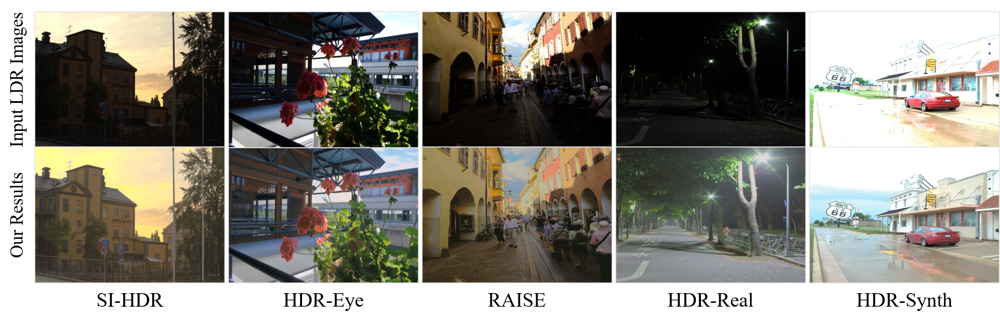

## Multi-Domain Raw-Reversal for Single-Image HDR Reconstruction  
This repository is an official implementation of the paper:

**Multi-Domain Raw-Reversal for Single-Image HDR Reconstruction**




## Environment Setup

    

* Clone this code

* Create a conda environment and activate it.

  ```
  conda create -n MDRR python=3.12
  conda activate MDRR
  ```

* Install related Pytorch version

  ```
  conda install pytorch==2.3.0 torchvision torchaudio pytorch-cuda=12.1 -c pytorch -c nvidia
  ```

* Install the required packages

  ```
  cd MDRRHDR
  pip install -r requirements.txt
  ```

  


## Datasets 

- Download the HDR-Real/HDR_Synth datasets from: [GitHub](https://github.com/alex04072000/SingleHDR)

- Download the HDR-Eye datasets from: [EPFL](https://www.epfl.ch/labs/mmspg/downloads/hdr-eye/)

- Download the SI-HDR datasets from: [Apollo](https://www.repository.cam.ac.uk/items/c02ccdde-db20-4acd-8941-7816ef6b7dc7)

- Download the Raise datasets from: [RAISE](http://loki.disi.unitn.it/RAISE/index.php)

  

## Testing Phase

- Download the pre-training model: [Google Drive](https://drive.google.com/file/d/1LfhLFaFoZ-XZnMoqDxXMmugU5ko3-lAX/view?usp=drive_link)

  ```
  mkdir ./checkpoints
  mv MDRR_test.ckpt ./checkpoints
  ```

- Edit the configuration file `./options.py` to the test images file.

- Run the test file:

  ```
  python test.py
  ```

  


## Training Phase

- Edit the configuration file `./options.py` to the test images file. 

- Run the train file:

  ```
  python train.py
  ```

* The training result will be saved in `./training_results/`
* The training checkpoints will be saved in `./training_checkpoints/`


## Metric Method

- Use the `./metric.py` for SSIM and LPIPS:

  ```
  python metric,py -generate your_generate_hdr/ -gt your_gt_hdr/
  ```

- Use the [PU21](https://github.com/gfxdisp/pu21/tree/main) for PSNR,  VSI and [HDR-VDP](https://hdrvdp.sourceforge.net/wiki/) for HDR-VDP-3.


## Results

- In HDR-Eye datasets:


- In HDR-Real datasets:


- In HDR-Synth datasets:


- In Raise datasets:


- In SI-HDR datasets:


